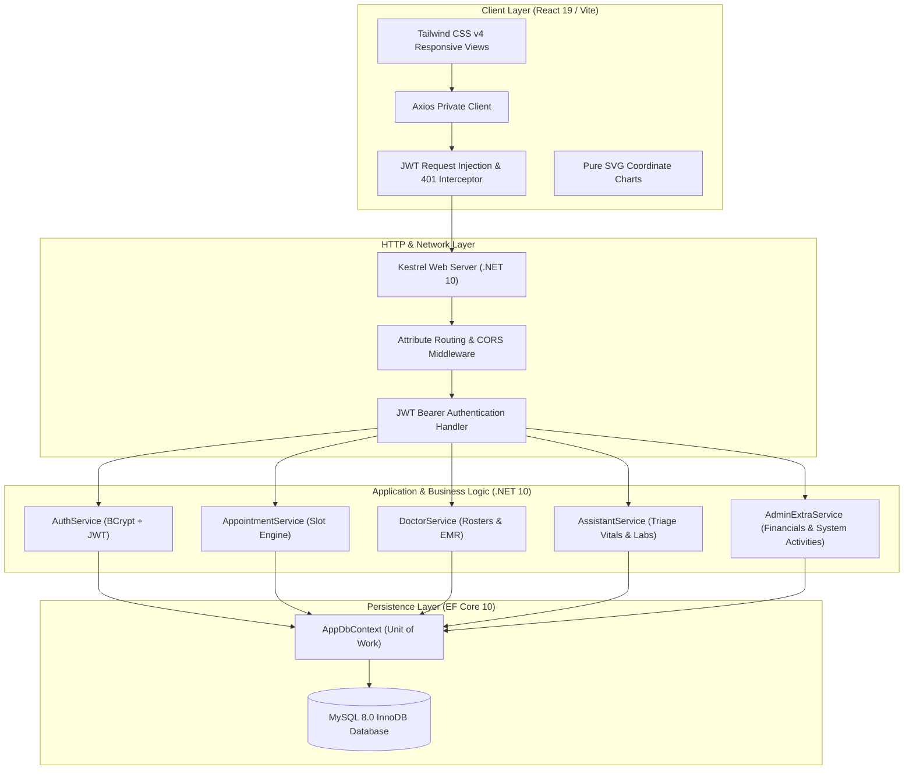
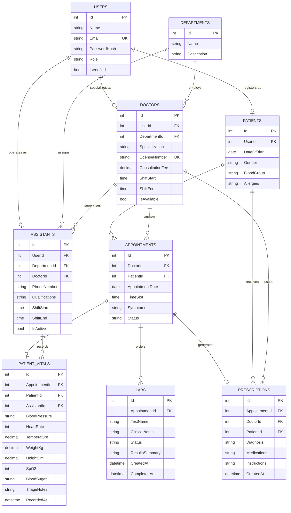

# CareFlow: Enterprise Hospital Management and Clinical Consultation Platform

CareFlow is a full stack, enterprise grade Hospital Management System (HMS) and Clinical Consultation Platform engineered with ASP.NET Core 10 Web API and React 19. Designed for modern healthcare providers and outpatient departments (OPD), CareFlow coordinates physician shift rosters, pre-consultation triage vitals acquisition, diagnostic laboratory workflows, real time consultation scheduling with multi user concurrency protection, digital Electronic Medical Records (EMR), automated patient no show detection, and hospital operational analytics.

## Table of Contents

1. [Architectural Overview](#architectural-overview)
2. [Key Features by Role](#key-features-by-role)
   * [1. Administrative Operations](#1-administrative-operations)
   * [2. Clinical Provider Portal (Doctor)](#2-clinical-provider-portal-doctor)
   * [3. Clinical Assistant & Triage Desk](#3-clinical-assistant--triage-desk)
   * [4. Patient Care Portal](#4-patient-care-portal)
3. [Engineering Highlights and Edge Case Defenses](#engineering-highlights-and-edge-case-defenses)
   * [1. Real Time Slot Locking and Concurrency Protection](#1-real-time-slot-locking-and-concurrency-protection)
   * [2. Temporal Parity: Pakistan Standard Time (PKT, UTC+5)](#2-temporal-parity-pakistan-standard-time-pkt-utc5)
   * [3. Idempotent Pre-Consultation Vitals Upsert](#3-idempotent-pre-consultation-vitals-upsert)
   * [4. Post-Consultation Diagnostic Immutability Rule](#4-post-consultation-diagnostic-immutability-rule)
   * [5. Multi-Entity System Activities Aggregation](#5-multi-entity-system-activities-aggregation)
   * [6. Chronological Queue Priority & Instant Consultation Launcher](#6-chronological-queue-priority--instant-consultation-launcher)
   * [7. Pure SVG Zero Dependency Visualizations](#7-pure-svg-zero-dependency-visualizations)
   * [8. Strict Institutional Design System](#8-strict-institutional-design-system)
   * [9. Assisted Booking Hotline & Phone Dispatch Architecture](#9-assisted-booking-hotline--phone-dispatch-architecture)
4. [Technology Stack](#technology-stack)
5. [Database Architecture](#database-architecture)
6. [API Reference](#api-reference)
   * [Authentication (`/api/Auth`)](#authentication-apiauth)
   * [Consultations and Scheduling (`/api/Appointment`)](#consultations-and-scheduling-apiappointment)
   * [Clinical Provider Operations (`/api/DoctorAppointment` & `/api/Doctor`)](#clinical-provider-operations-apidoctorappointment--apidoctor)
   * [Clinical Assistant & Triage Desk (`/api/Assistant`)](#clinical-assistant--triage-desk-apiassistant)
   * [Patient Operations (`/api/PatientAppointment`)](#patient-operations-apipatientappointment)
   * [Administration and Analytics (`/api/Admin`)](#administration-and-analytics-apiadmin)
7. [Getting Started and Local Setup](#getting-started-and-local-setup)
8. [Directory Structure](#directory-structure)
9. [License](#license)

---

## Architectural Overview

CareFlow follows an N Tier Layered Architecture with strict separation of concerns, dependency injection, and centralized JWT authentication with automatic silent refresh via private Axios interceptors.



---

## Key Features by Role

### 1. Administrative Operations
* **Financial and Capacity Telemetry:** Real time metrics on daily hospital revenue, active consultations, doctor roster status, and department bed allocation.
* **Rolling Weekly Trend Visualizer:** Proprietary Pure SVG bar chart rendering 7 day completed consultation volumes without external charting dependencies.
* **Specialist Credentialing:** Account verification, license validation, department assignment, and on demand duty activation.
* **Clinical Assistant Management:** Register and assign triage staff to specific physicians or department pools with defined duty shifts.
* **Unified System Activities Audit:** Real time activity log aggregating appointment creations, assistant triage vitals recordings, diagnostic lab orders, finalized pathology findings, and staff onboarding.

### 2. Clinical Provider Portal (Doctor)
* **Single Screen Clinical Console:** Integrated shift schedule, queue summary with Checked-In priority, and consultation records on a unified layout.
* **Instant Consultation Launcher:** Direct 1-click consultation initiation for waiting patients marked `CheckedIn` by the triage station.
* **Pre-Consultation Vitals Review:** Automatic pre-load of nurse-captured physiological parameters (BP, Pulse, SpO2, Temperature, Blood Sugar, BMI) inside the consultation modal.
* **Longitudinal Patient Pathology History:** Direct access to past laboratory diagnostic tests and analyzer findings across all previous patient visits.
* **Digital Prescription Generation:** Modal based prescription writer capturing primary diagnoses, medications, dosage instructions, and follow up directives.
* **Diagnostic Lab Ordering:** Prescribe pathology panels (CBC, LFT, RFT, Lipid Profile, X-Ray) with specialized clinical notes for the laboratory desk.

### 3. Clinical Assistant & Triage Desk
* **OPD Patient Queue & Check-In:** View today's scheduled consultations scoped by assigned doctor or department, with instant physical arrival check-in.
* **Pre-Consultation Vitals Capture:** Record multi-parameter physiological vitals with real-time clinical warnings (Hypertension alerts, Fever indicators, Hypoxemia warnings).
* **Idempotent Re-Measurement:** Seamlessly re-take and update patient vitals to resolve White Coat Hypertension without constraint violations.
* **Diagnostic Lab Desk:** Manage specimen collection (Blood, Urine, Swab) and enter finalized quantitative laboratory results.
* **Tamper-Evident State Lock:** Diagnostic orders and vitals for completed or past consultations are locked authoritatively against modification.
* **Assisted Booking & Walk-In Intake:** Schedule consultations directly on behalf of illiterate, phone call, or walk-in patients via `POST /api/Assistant/book-appointment`. Automatically unifies repeat patient charts by telephone deduplication or provisions a verified identity behind the scenes without user login requirements.

### 4. Patient Care Portal
* **Physician Discovery and Clinical Profile:** Browse certified specialists by medical department, clinical focus, experience, and consultation fees.
* **Live Shift Slot Selector:** Dynamic time picker displaying accessible consultation windows while immediately disabling occupied or past slots.
* **Appointment Management:** Filter personal ledger by status (`Pending`, `Confirmed`, `CheckedIn`, `Completed`, `Cancelled`, `Missed`).
* **Digital Prescription & Lab Archive:** View and download issued EMR prescriptions and finalized diagnostic laboratory reports.
* **Self Service Cancellation:** Cancel pending or confirmed bookings, immediately releasing the slot back into the public scheduling pool.

---

## Engineering Highlights and Edge Case Defenses

### 1. Real Time Slot Locking and Concurrency Protection
* **The Vulnerability:** Multiple patients attempting to reserve the identical time slot concurrently, or reserving a slot that is currently in a `Pending` state awaiting physician confirmation.
* **The Solution:** The backend query `GetBookedSlots` evaluates all slots where `(Status == "Confirmed" || Status == "Pending" || Status == "Completed")`.
* **Database Isolation:** When two patients submit a booking request for the identical slot at the same millisecond:
  * Thread 1 acquires the transactional write lock, commits the row with `Status = "Pending"`, and returns `HTTP 201 Created`.
  * Thread 2's `AnyAsync` validation catches the committed row, aborts the insert, and throws a `DuplicateNameException`.
  * The API responds with `HTTP 400 Bad Request` (`"This Time slot is already Booked"`).
  * The frontend client intercepts the error, renders a notification, and immediately refetches `/api/Appointment/booked-slots`, visibly disabling the slot on screen.

### 2. Temporal Parity: Pakistan Standard Time (PKT, UTC+5)
* Server clocks running on UTC frequently corrupt boundary dates during late night hours (for example, 02:00 AM PKT is 09:00 PM UTC of the previous calendar day).
* CareFlow standardizes all operational timestamps to **Pakistan Standard Time (PKT, UTC+5)** across:
  * **Server Service Layer:** `DateTime.UtcNow.AddHours(5)` across revenue sums, audit timestamps, OPD queues, and daily metrics.
  * **Frontend Client:** `Intl.DateTimeFormat('en-CA', { timeZone: 'Asia/Karachi' })` ensuring timezone consistency regardless of patient client location.

### 3. Idempotent Pre-Consultation Vitals Upsert
* Patients frequently experience elevated blood pressure upon initial hospital arrival ("White Coat Hypertension"). Triage nurses instruct patients to rest and take a second reading 15 minutes later.
* `AssistantService.RecordVitals` checks for an existing record on `AppointmentId`. If present, it updates the row in-place rather than attempting a duplicate `INSERT`, avoiding MySQL unique constraint collisions on `IX_PatientVitals_AppointmentId`.

### 4. Post-Consultation Diagnostic Immutability Rule
* Once a doctor completes an examination and issues the prescription, clinical and legal standards mandate that diagnostic orders become immutable.
* Both `CreateLabOrder` and `UpdateLabOrderStatus` in `AssistantService.cs` enforce `if (appointment.Status == "Completed") throw new InvalidOperationException(...)`.
* The DTO projects `IsAppointmentCompleted` and `AppointmentStatus`, dynamically locking frontend buttons in `AssistantLabDesk.jsx` to render `"Locked (Completed)"`.

### 5. Multi-Entity System Activities Aggregation
* Operational audit requirements demand that the administrative dashboard displays all clinical actions across roles.
* `AdminExtraService.cs` aggregates five asynchronous event streams into `RecentActivities`:
  1. Appointment bookings and confirmations
  2. Patient triage vitals recordings
  3. Pathology lab tests ordered
  4. Finalized laboratory test findings
  5. Assistant staff registrations
* The aggregated stream is projected into a unified schema and sorted descending by timestamp.

### 6. Chronological Queue Priority & Instant Consultation Launcher
* In high-volume outpatient clinics, walk-ins, emergency additions, and newly checked-in patients must appear at the top of the queue.
* All queries across Doctor, Assistant, and Patient dashboards enforce `.OrderByDescending(a => a.AppointmentDate).ThenByDescending(a => a.TimeSlot).ThenByDescending(a => a.Id)`.
* When a patient is checked in at triage, their status updates to `CheckedIn`, displaying an instant **Start Consultation** trigger on the attending doctor's dashboard.

### 7. Pure SVG Zero Dependency Visualizations
* **Donut Chart:** Built using mathematical circle circumference geometry ($C = 2\pi r$), dynamic `strokeDasharray`, and cumulative `strokeDashoffset` rotations.
* **Weekly Bar Chart:** Built using pure SVG `<rect>` elements normalized dynamically against `Math.max(...completedCount, 1)` within a responsive `<svg viewBox="0 0 500 200">` canvas.

### 8. Strict Institutional Design System
* **Universal Typography:** Enforced the `Inter` font globally across all HTML tags, form controls, inputs, and buttons.
* **De-Vibe Coded Text Hierarchy:** Eliminated rounded gray box badges in table cells, replacing them with clean, high-contrast typography.
* **Scrollbar Optimization:** Implemented `.scrollbar-none` to eliminate horizontal scrollbar tracks on Windows Chromium while preserving scrolling behavior.

### 9. Assisted Booking Hotline & Phone Dispatch Architecture
* **The Reality:** A large demographic of hospital patients, especially the elderly, rural visitors, and non-tech-savvy individuals, cannot self-register online accounts or navigate digital portals.
* **The Solution:** Clinical assistants act as digital dispatchers equipped with direct phone lines:
  * **Institutional Hotline & Physician Cards:** Dedicated `PhoneNumber` hotlines are exposed prominently on the home page (`/`) and directly within each specialist's card (`Call Assistant: [Phone]`).
  * **Composite Multi-Factor MPI Deduplication:** To prevent medical chart overlay corruption when multiple family members share a household phone (e.g., father and son sharing `03001234567`), the engine matches by composite `(PhoneNumber, Name)`. Returning patients reuse their existing longitudinal record, while distinct family members receive dedicated patient charts and unique collision-free synthetic emails (`walkin.{phone}.{name}@careflow.hospital`).
  * **Department-Scoped Scheduling Governance:** Enforces clinical governance where assistants can only schedule appointments for physicians within their assigned clinical department (`Assistant.DepartmentId == Doctor.DepartmentId`). Intra-department cross-coverage is permitted (e.g. covering partner cardiologists), but cross-specialty errors are blocked authoritatively with `HTTP 403 Forbidden`.
  * **Scoped Doctor Query (`GET /api/Assistant/schedulable-doctors`):** The triage booking modal dynamically populates only authorized peer physicians belonging to the assistant's clinical department.

---

## Technology Stack

### Backend
| Technology | Version | Purpose |
| :--- | :--- | :--- |
| **ASP.NET Core** | 10.0 | High performance Web API framework |
| **C#** | 13.0 | Modern language features (Pattern matching, records, null safety) |
| **Entity Framework Core** | 10.0 | ORM and data access layer with LINQ |
| **Pomelo.EntityFrameworkCore.MySql** | 9.0 | High throughput MySQL database connector |
| **BCrypt.Net-Next** | 4.0.3 | Salted password hashing |
| **System.IdentityModel.Tokens.Jwt** | 8.x | Cryptographic token creation and validation |

### Frontend
| Technology | Version | Purpose |
| :--- | :--- | :--- |
| **React** | 19.0 | Concurrent React component rendering |
| **Vite** | 6.0 | Sub second HMR build tooling |
| **Tailwind CSS** | 4.0 | Utility first responsive design framework |
| **React Router** | 7.x | Client side routing with guarded route wrappers |
| **Axios** | 1.8 | HTTP client configured with request and response interceptors |
| **Lucide React** | 1.16 | Consistent iconography |

---

## Database Architecture



---

## API Reference

### Authentication (`/api/Auth`)
| Method | Route | Access | Description |
| :--- | :--- | :--- | :--- |
| `POST` | `/api/Auth/register` | Public | Register a patient account |
| `POST` | `/api/Auth/login` | Public | Authenticate user; returns Access Token and Refresh Token |
| `POST` | `/api/Auth/refresh-token` | Public | Exchange expired access token using valid refresh token |
| `POST` | `/api/Auth/logout` | Authorized | Invalidate current user refresh session |

### Consultations and Scheduling (`/api/Appointment`)
| Method | Route | Access | Description |
| :--- | :--- | :--- | :--- |
| `GET` | `/api/Appointment/availability` | Public | Query verified physicians by department, date, and time |
| `GET` | `/api/Appointment/booked-slots` | Public | Retrieve occupied shift slots for a doctor on a specific date |
| `POST` | `/api/Appointment/booking` | Patient | Submit consultation request with double booking verification |

### Clinical Provider Operations (`/api/DoctorAppointment` & `/api/Doctor`)
| Method | Route | Access | Description |
| :--- | :--- | :--- | :--- |
| `GET` | `/api/DoctorAppointment/my-appointments` | Doctor | Retrieve physician consultation roster in descending order |
| `PUT` | `/api/DoctorAppointment/status` | Doctor | Transition consultation state (`Confirmed`, `Missed`) |
| `POST` | `/api/Doctor/prescription` | Doctor | Issue formal prescription and complete consultation |
| `GET` | `/api/Doctor/patient-history/{id}` | Doctor | View patient longitudinal medical and diagnostic history |

### Clinical Assistant & Triage Desk (`/api/Assistant`)
| Method | Route | Access | Description |
| :--- | :--- | :--- | :--- |
| `POST` | `/api/Assistant/register` | Admin | Register and onboard a new clinical assistant |
| `GET` | `/api/Assistant/all` | Admin | List all registered assistants with duty shifts |
| `PUT` | `/api/Assistant/{id}` | Admin | Update assistant shift, doctor assignment, or active status |
| `DELETE` | `/api/Assistant/{id}` | Admin | Delete assistant profile (restricted if triage history exists) |
| `GET` | `/api/Assistant/my-assistants` | Doctor | View assistants assigned to the calling doctor |
| `GET` | `/api/Assistant/queue` | Assistant, Admin | Today's OPD queue in PKT, ordered descending |
| `PATCH` | `/api/Assistant/check-in/{appointmentId}` | Assistant, Admin | Check in waiting patient at triage desk |
| `POST` | `/api/Assistant/book-appointment` | Assistant, Admin | Assisted booking for phone call / walk-in patients with auto-provisioning |
| `GET` | `/api/Assistant/schedulable-doctors` | Assistant, Admin | Retrieve authorized specialists within assistant's assigned department |
| `POST` | `/api/Assistant/vitals` | Assistant, Admin | Record or update pre-consultation triage vitals |
| `GET` | `/api/Assistant/vitals/{appointmentId}` | Assistant, Doctor, Admin | Get recorded vitals for an appointment |
| `POST` | `/api/Assistant/lab-order` | Doctor, Admin | Prescribe a diagnostic laboratory test |
| `GET` | `/api/Assistant/lab-orders/{appointmentId}` | Assistant, Doctor, Patient, Admin | Get lab orders for an appointment |
| `GET` | `/api/Assistant/pending-lab-orders` | Assistant, Admin | Pending specimen collection and results queue |
| `PUT` | `/api/Assistant/lab-order/{id}/status` | Assistant, Doctor, Admin | Update specimen collection state and laboratory results |
| `GET` | `/api/Assistant/patient-lab-history/{patientId}` | Doctor, Assistant, Admin | Longitudinal pathology history across all visits |

### Patient Operations (`/api/PatientAppointment`)
| Method | Route | Access | Description |
| :--- | :--- | :--- | :--- |
| `GET` | `/api/PatientAppointment/my-appointments` | Patient | View scheduled consultations (auto marks expired no shows) |
| `PUT` | `/api/PatientAppointment/cancel/{id}` | Patient | Cancel appointment and restore slot availability |

### Administration and Analytics (`/api/Admin`)
| Method | Route | Access | Description |
| :--- | :--- | :--- | :--- |
| `GET` | `/api/Admin/extra-stats` | Admin | Daily revenue, active appointments, 7 day trend, and aggregated activities |
| `PUT` | `/api/Admin/toggle-doctor/{id}` | Admin | Toggle physician on duty or off duty roster status |
| `POST` | `/api/Admin/verify-doctor/{id}` | Admin | Verify and activate newly registered physician |

---

## Getting Started and Local Setup

### Prerequisites
* .NET 10 SDK
* Node.js (v20.x or higher)
* MySQL Server (v8.0 or higher)

### 1. Database Configuration
1. Start your local MySQL service.
2. In `backend/appsettings.json`, update your database connection string:
   ```json
   {
     "ConnectionStrings": {
       "DefaultConnection": "Server=localhost;Port=3306;Database=hospital;User=root;Password=YOUR_PASSWORD;"
     },
     "Jwt": {
       "Key": "YOUR_STRONG_SECRET_KEY_MIN_32_CHARACTERS",
       "Issuer": "CareFlowServer",
       "Audience": "CareFlowClient",
       "DurationMinutes": 60
     }
   }
   ```

### 2. Backend Initialization
```bash
cd backend

# Restore dependencies and build solution
dotnet restore
dotnet build

# Apply database migrations
dotnet ef database update

# Launch Web API server (Runs on http://localhost:5282)
dotnet run
```

### 3. Frontend Initialization
```bash
cd frontend

# Install package dependencies
npm install

# Start Vite development server (Runs on http://localhost:5173)
npm run dev
```

---

## Directory Structure

```
Hospital Management System/
├── backend/
│   ├── Controllers/             # REST API Controllers (Auth, Appointment, Doctor, Assistant, Admin)
│   ├── Data/                    # EF Core AppDbContext & Database Configurations
│   ├── DTOs/                    # Request & Response Data Transfer Objects (AssistantDtos, etc.)
│   ├── Interfaces/              # Business Service Interfaces (IAssistant, IDoctorApis, etc.)
│   ├── Migrations/              # Entity Framework Database Migrations
│   ├── Models/                  # Domain Entities (User, Doctor, Assistant, PatientVitals, Labs)
│   ├── Services/                # Core Business Logic (AssistantService, DoctorApis, AdminExtraService)
│   ├── appsettings.json         # Database & JWT Configuration
│   └── Program.cs               # Middleware Pipeline & DI Registration
│
├── frontend/
│   ├── src/
│   │   ├── api/                 # Axios Base Instance & Public Clients
│   │   ├── components/          # Reusable UI Elements (Modals, ProtectedRoutes, GuestRoute)
│   │   ├── context/             # Global AuthContext & State Hydration
│   │   ├── hooks/               # Custom Hooks (useAuth, useAxiosPrivate)
│   │   ├── Pages/
│   │   │   ├── Admin/           # Admin Analytics, Doctors, Assistants, Departments, Schedules
│   │   │   ├── Doctor/          # Clinical Overview, Appointments, EHR, Prescriptions, Assistants
│   │   │   ├── Assistant/       # Triage Queue, Vitals Capture, Lab Desk, Specimen Collection
│   │   │   ├── Patient/         # Patient Dashboard, Booking Flow, History, Prescriptions
│   │   │   ├── DoctorPublicProfile.jsx  # Public Specialist Profile & Booking Console
│   │   │   └── Login.jsx / Register.jsx # Authentication Portals
│   │   ├── App.jsx              # Application Route Registry
│   │   ├── index.css            # Global Typography (Inter), Utilities (.scrollbar-none)
│   │   └── main.jsx             # Entry Point
│   ├── package.json
│   └── vite.config.js
│
└── README.md                    # Root System Documentation
```

---

## License
This project is licensed under the MIT License. See the LICENSE file for details.
