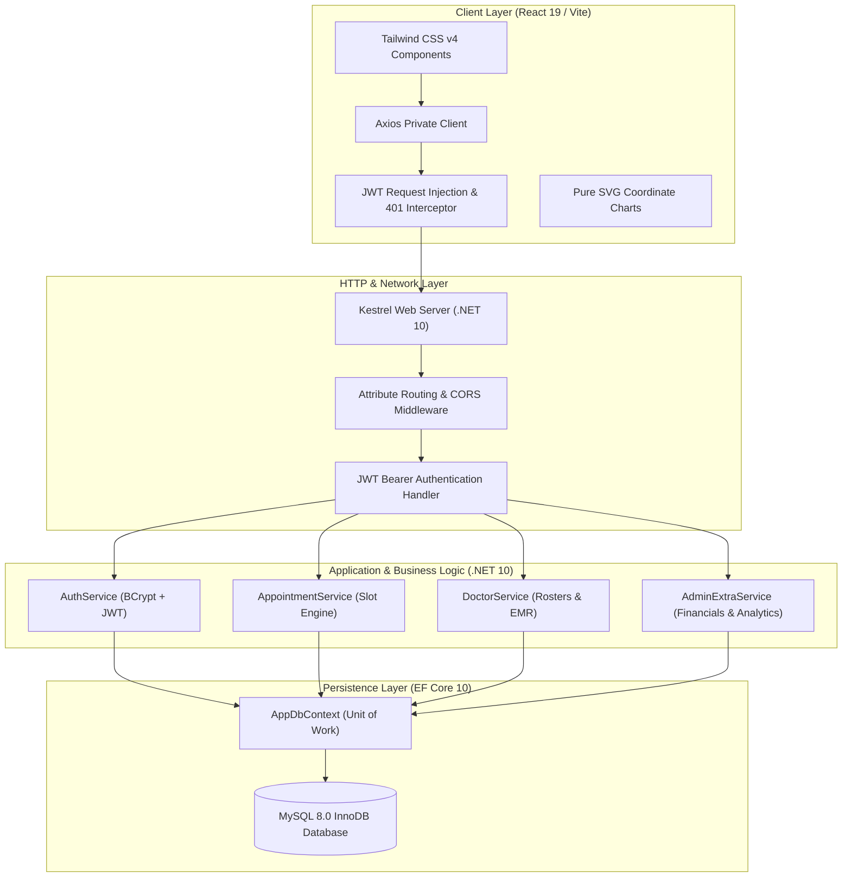
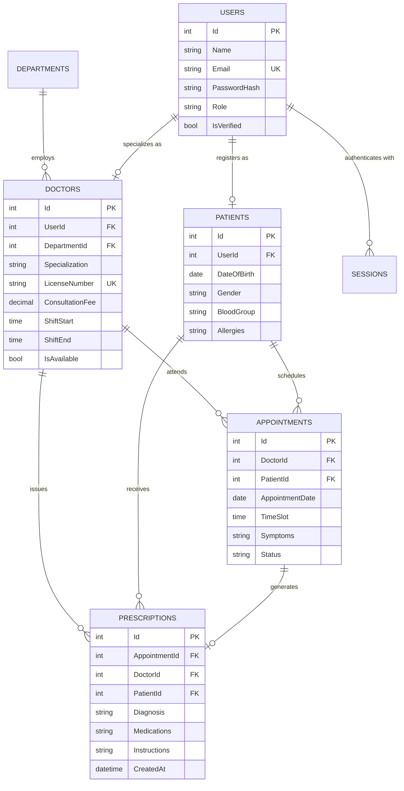

# CareFlow: Enterprise Hospital Management and Clinical Consultation Platform

CareFlow is a full stack, enterprise grade Hospital Management System (HMS) and Clinical Consultation Platform engineered with ASP.NET Core 10 Web API and React 19. Designed for modern healthcare providers, CareFlow coordinates physician shift rosters, real time consultation scheduling with multi user concurrency protection, digital Electronic Medical Records (EMR), automated patient no show detection, and hospital financial analytics.

## Table of Contents

1. [Architectural Overview](#architectural-overview)
2. [Key Features by Role](#key-features-by-role)
   * [Administrative Operations](#1-administrative-operations)
   * [Clinical Provider Portal (Doctor)](#2-clinical-provider-portal-doctor)
   * [Patient Care Portal](#3-patient-care-portal)
3. [Engineering Highlights and Edge Case Defenses](#engineering-highlights-and-edge-case-defenses)
   * [Real Time Slot Locking and Concurrency Protection](#1-real-time-slot-locking-and-concurrency-protection)
   * [Temporal Parity: Pakistan Standard Time (PKT, UTC+5)](#2-temporal-parity-pakistan-standard-time-pkt-utc5)
   * [Automated Clinical Session Expiration (No Show Engine)](#3-automated-clinical-session-expiration-no-show-engine)
   * [Pure SVG Zero Dependency Visualizations](#4-pure-svg-zero-dependency-visualizations)
   * [Strict Enterprise Design System](#5-strict-enterprise-design-system)
4. [Technology Stack](#technology-stack)
5. [Database Architecture](#database-architecture)
6. [API Reference](#api-reference)
7. [Getting Started and Local Setup](#getting-started-and-local-setup)
8. [Directory Structure](#directory-structure)
9. [License](#license)

## Architectural Overview

CareFlow follows an N Tier Layered Architecture with strict separation of concerns, dependency injection, and centralized JWT authentication with automatic silent refresh via private Axios interceptors.



## Key Features by Role

### 1. Administrative Operations
* **Financial and Capacity Telemetry:** Real time metrics on daily hospital revenue, active consultations, doctor roster status, and department bed allocation.
* **Rolling Weekly Trend Visualizer:** Proprietary Pure SVG bar chart rendering 7 day completed consultation volumes without external charting dependencies.
* **Specialist Credentialing:** Account verification, license validation, department assignment, and on demand duty activation.
* **Audit Trail:** Immutable activity logs documenting administrative updates, role elevations, and automated system actions.

### 2. Clinical Provider Portal (Doctor)
* **Single Screen Clinical Console:** Integrated shift schedule, queue summary, and consultation records on a unified layout.
* **Electronic Health Records (EHR):** Direct patient history inspection including blood group, allergies, past diagnoses, and prior treatment courses.
* **Digital Prescription Generation:** Modal based prescription writer capturing primary diagnoses, prescription instructions, dosage regimens, and follow up directives.
* **Lifecycle State Transitions:** Ability to advance consultations (`Confirmed` to `Completed` or mark as `Missed / No Show`).

### 3. Patient Care Portal
* **Physician Discovery and Clinical Profile:** Browse certified specialists by medical department, clinical focus, experience, and consultation fees.
* **Live Shift Slot Selector:** Dynamic time picker displaying accessible consultation windows while immediately disabling occupied or past slots.
* **Appointment Management:** Filter personal ledger by status (`Pending`, `Confirmed`, `Completed`, `Cancelled`, `Missed`).
* **Self Service Cancellation:** Cancel pending or confirmed bookings, immediately releasing the slot back into the public scheduling pool.

## Engineering Highlights and Edge Case Defenses

### 1. Real Time Slot Locking and Concurrency Protection
* **The Vulnerability:** Multiple patients attempting to reserve the identical time slot concurrently, or reserving a slot that is currently in a `Pending` state awaiting physician confirmation.
* **The Solution:** The backend query `GetBookedSlots` evaluates all slots where `(Status == "Confirmed" || Status == "Pending" || Status == "Completed")`.
* **Database Isolation:** When two patients submit a booking request for the identical slot at the same millisecond:
  * Thread 1 acquires the transactional write lock, commits the row with `Status = "Pending"`, and returns `HTTP 201 Created`.
  * Thread 2's `AnyAsync` validation catches the committed row, aborts the insert, and throws a `DuplicateNameException`.
  * The API responds with `HTTP 400 Bad Request` (`"This Time slot is already Booked"`).
  * The frontend client intercepts the error, renders a notification, and immediately refetches `/api/Appointment/booked-slots`, visibly disabling the slot on screen.

### 2. Temporal Parity: Pakistan Standard Time (PKT, UTC+5)
* Server clocks running on UTC frequently corrupt boundary dates during late night hours (for example, 02:00 AM PKT is 09:00 PM UTC of the previous calendar day).
* CareFlow standardizes all operational timestamps to **Pakistan Standard Time (PKT, UTC+5)** across:
  * **Server Service Layer:** `DateTime.UtcNow.AddHours(5)` across revenue sums, audit timestamps, and daily metrics.
  * **Frontend Client:** `Intl.DateTimeFormat('en-CA', { timeZone: 'Asia/Karachi' })` ensuring timezone consistency regardless of patient client location.

### 3. Automated Clinical Session Expiration (No Show Engine)
* Scheduled appointments unattended by patients are automatically detected during queue queries.
* The system evaluates `(AppointmentDate < Today || (AppointmentDate == Today && TimeSlot < CurrentTime))` and updates the state to `Missed`.
* Prevents unattended consultations from distorting daily capacity statistics.

### 4. Pure SVG Zero Dependency Visualizations
To achieve optimal bundle sizes, eliminate third party security vulnerabilities, and ensure forward compatibility with React 19:
* **Donut Chart:** Built using mathematical circle circumference geometry ($C = 2\pi r$), dynamic `strokeDasharray`, and cumulative `strokeDashoffset` rotations.
* **Weekly Bar Chart:** Built using pure SVG `<rect>` elements normalized dynamically against `Math.max(...completedCount, 1)` within a responsive `<svg viewBox="0 0 500 200">` canvas.

### 5. Strict Enterprise Design System
* **Monochrome Palette:** Replaced prototype pastel pills with an institutional Slate scale (`bg-slate-100 text-slate-700 border border-slate-200`).
* **Action vs Status Hierarchy:** Table columns titled "Action" strictly render clickable action buttons (`Cancel`, `Prescribe`). Non actionable terminal rows (`Completed`, `Cancelled`, `Missed`) render clean, unadorned typography (`text-slate-400 pr-1`) without container boxes.
* **Legible Disabled States:** Disabled slots utilize `opacity-75` and distinct indicator badges (`Booked`, `Passed`), preserving full textual readability without harsh strikethrough styling.

## Technology Stack

### Backend
| Technology | Version | Purpose |
| :--- | :--- | :--- |
| **ASP.NET Core** | 10.0 | High performance Web API framework |
| **C#** | 13.0 | Modern language features (Pattern matching, records, null safety) |
| **Entity Framework Core** | 10.0 | ORM and data access layer with LINQ |
| **Pomelo.EntityFrameworkCore.MySql** | 9.0 | High throughput MySQL database connector |
| **BCrypt.Net-Next** | 4.0.3 | Salted password hashing |
| **System.IdentityModel.Tokens.Jwt** | 8.x | Cryptographic token creation and validation |

### Frontend
| Technology | Version | Purpose |
| :--- | :--- | :--- |
| **React** | 19.0 | Concurrent React component rendering |
| **Vite** | 6.0 | Sub second HMR build tooling |
| **Tailwind CSS** | 4.0 | Utility first responsive design framework |
| **React Router** | 7.x | Client side routing with guarded route wrappers |
| **Axios** | 1.8 | HTTP client configured with request and response interceptors |
| **Lucide React** | 1.16 | Consistent iconography |

## Database Architecture



## API Reference

### Authentication (`/api/Auth`)
| Method | Route | Access | Description |
| :--- | :--- | :--- | :--- |
| `POST` | `/api/Auth/register` | Public | Register a patient account |
| `POST` | `/api/Auth/login` | Public | Authenticate user; returns Access Token and Refresh Token |
| `POST` | `/api/Auth/refresh-token` | Public | Exchange expired access token using valid refresh token |
| `POST` | `/api/Auth/logout` | Authorized | Invalidate current user refresh session |

### Consultations and Scheduling (`/api/Appointment`)
| Method | Route | Access | Description |
| :--- | :--- | :--- | :--- |
| `GET` | `/api/Appointment/availability` | Public | Query verified physicians by department, date, and time |
| `GET` | `/api/Appointment/booked-slots` | Public | Retrieve occupied shift slots for a doctor on a specific date |
| `POST` | `/api/Appointment/booking` | Patient | Submit consultation request with double booking verification |

### Patient Operations (`/api/PatientAppointment`)
| Method | Route | Access | Description |
| :--- | :--- | :--- | :--- |
| `GET` | `/api/PatientAppointment/my-appointments` | Patient | View scheduled consultations (auto marks expired no shows) |
| `PUT` | `/api/PatientAppointment/cancel/{id}` | Patient | Cancel appointment and restore slot availability |

### Clinical Operations (`/api/DoctorAppointment`)
| Method | Route | Access | Description |
| :--- | :--- | :--- | :--- |
| `GET` | `/api/DoctorAppointment/my-appointments` | Doctor | Retrieve physician consultation roster |
| `PUT` | `/api/DoctorAppointment/status` | Doctor | Transition consultation state (`Confirmed`, `Missed`) |
| `POST` | `/api/Doctor/prescription` | Doctor | Issue formal prescription and complete consultation |

### Administration and Analytics (`/api/Admin`)
| Method | Route | Access | Description |
| :--- | :--- | :--- | :--- |
| `GET` | `/api/Admin/extra-stats` | Admin | Retrieve daily revenue, active appointments, and 7 day trend |
| `PUT` | `/api/Admin/toggle-doctor/{id}` | Admin | Toggle physician on duty or off duty roster status |
| `POST` | `/api/Admin/verify-doctor/{id}` | Admin | Verify and activate newly registered physician |

## Getting Started and Local Setup

### Prerequisites
* .NET 10 SDK
* Node.js (v20.x or higher)
* MySQL Server (v8.0 or higher)

### 1. Database Configuration
1. Start your local MySQL service.
2. In `backend/appsettings.json`, update your database connection string:
   ```json
   {
     "ConnectionStrings": {
       "DefaultConnection": "Server=localhost;Port=3306;Database=hospital;User=root;Password=YOUR_PASSWORD;"
     },
     "Jwt": {
       "Key": "YOUR_STRONG_SECRET_KEY_MIN_32_CHARACTERS",
       "Issuer": "CareFlowServer",
       "Audience": "CareFlowClient",
       "DurationMinutes": 60
     }
   }
   ```

### 2. Backend Initialization
```bash
cd backend

# Restore dependencies and build solution
dotnet restore
dotnet build

# Apply database migrations
dotnet ef database update

# Launch Web API server (Runs on http://localhost:5282)
dotnet run
```

### 3. Frontend Initialization
```bash
cd frontend

# Install package dependencies
npm install

# Start Vite development server (Runs on http://localhost:5173)
npm run dev
```

## Directory Structure

```
Hospital Management System/
├── backend/
│   ├── Controllers/             # REST API Controllers (Auth, Appointment, Doctor, Admin)
│   ├── Data/                    # EF Core AppDbContext & Database Configurations
│   ├── DTOs/                    # Request & Response Data Transfer Objects
│   ├── Interfaces/              # Business Service Interfaces
│   ├── Migrations/              # Entity Framework Database Migrations
│   ├── Models/                  # Domain Entities (User, Doctor, Patient, Appointment)
│   ├── Services/                # Core Business Logic (AppointmentService, AuthService)
│   ├── appsettings.json         # Database & JWT Configuration
│   └── Program.cs               # Middleware Pipeline & DI Registration
│
├── frontend/
│   ├── src/
│   │   ├── api/                 # Axios Base Instance & Public Clients
│   │   ├── components/          # Reusable UI Elements (Modals, ProtectedRoutes, GuestRoute)
│   │   ├── context/             # Global AuthContext & State Hydration
│   │   ├── hooks/               # Custom Hooks (useAuth, useAxiosPrivate)
│   │   ├── Pages/
│   │   │   ├── Admin/           # Admin Analytics, Doctors, Departments, Schedules
│   │   │   ├── Doctor/          # Clinical Overview, Appointments, EHR, Prescriptions
│   │   │   ├── Patient/         # Patient Dashboard, Booking Flow, History
│   │   │   ├── DoctorPublicProfile.jsx  # Public Specialist Profile & Booking Console
│   │   │   └── Login.jsx / Register.jsx # Authentication Portals
│   │   ├── App.jsx              # Application Route Registry
│   │   └── main.jsx             # Entry Point
│   ├── package.json
│   └── vite.config.js
│
└── README.md                    # Root Documentation
```

## License
This project is licensed under the MIT License. See the LICENSE file for details.
